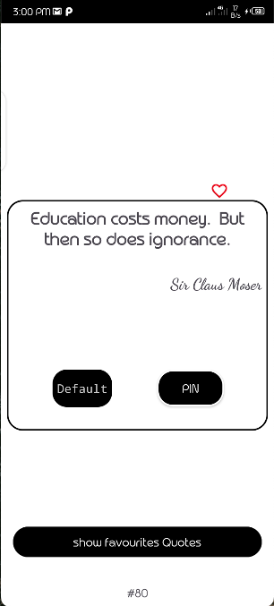
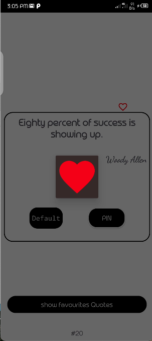
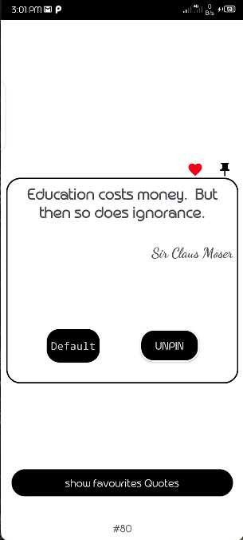

# Quotes Android Application

This project is an Android application named "Quotes" that allows users to explore and interact with various quotes.

## Features

- Get a randomly generated quote.
- Love a quote and mark it as a favorite.
- Pin a quote to save it for later.
- View all your favorite quotes in the "Favorites" section.

## Screens

The project includes the following screens:

1. **Home**: This screen displays a randomly generated quote.
   
   

2. **Love Quote**: Allows users to love a quote and mark it as a favorite.
   
   

3. **Pin Quote**: Enables users to pin a quote and save it for later.
   
   

4. **Favorites Quotes**: Shows all the quotes that the user has marked as favorites.
   
   

Feel free to explore the repository and the screenshots to get a better understanding of the application.

## Installation

To run the Quotes Android application locally, follow these steps:

1. Clone the repository: `git clone https://github.com/your-username/quotes-android.git`.
2. Open the project in Android Studio.
3. Build and run the application on an Android emulator or device.

Make sure you have the necessary dependencies and a compatible version of Android Studio installed.

## Contributing

If you'd like to contribute to this project, please follow these guidelines:

1. Fork the repository.
2. Create a new branch: `git checkout -b feature/your-feature`.
3. Make your changes and commit them: `git commit -m 'Add your feature'`.
4. Push to the branch: `git push origin feature/your-feature`.
5. Submit a pull request.

Please ensure your code follows the project's coding style and includes appropriate documentation.

## License

This project is licensed under the [MIT License](LICENSE). Feel free to use and modify the code according to your needs.

## Acknowledgements

We would like to thank the following resources for their contributions and inspiration:

- [Quote API](https://api.example.com) - The API used to retrieve the quotes.
- [Iconfinder](https://www.iconfinder.com) - The source of the application's icons.

If you have any questions or feedback, please don't hesitate to contact us.
